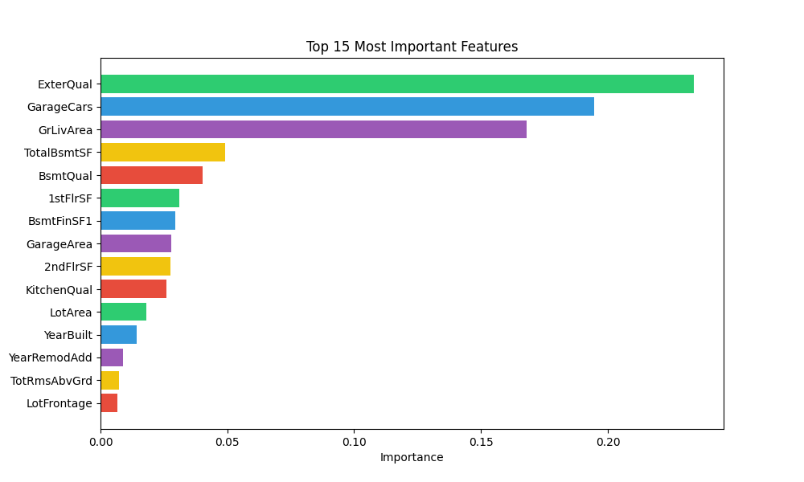
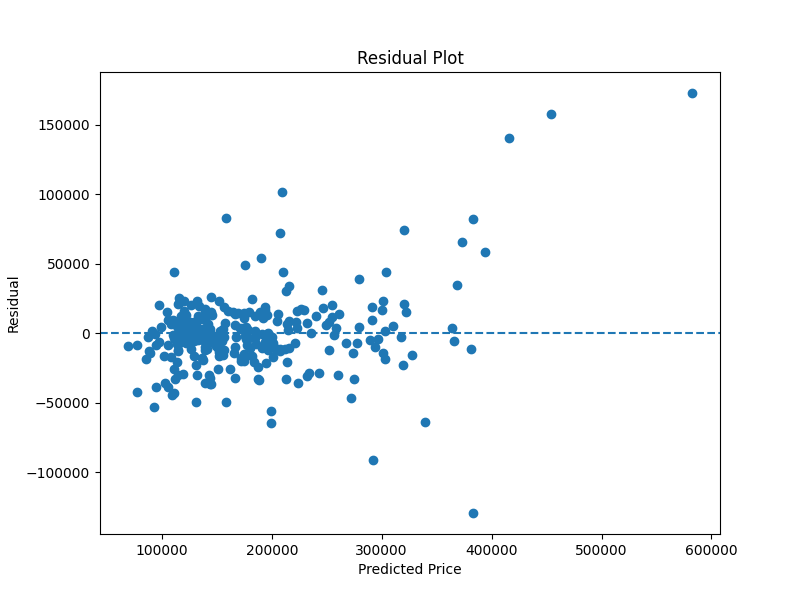
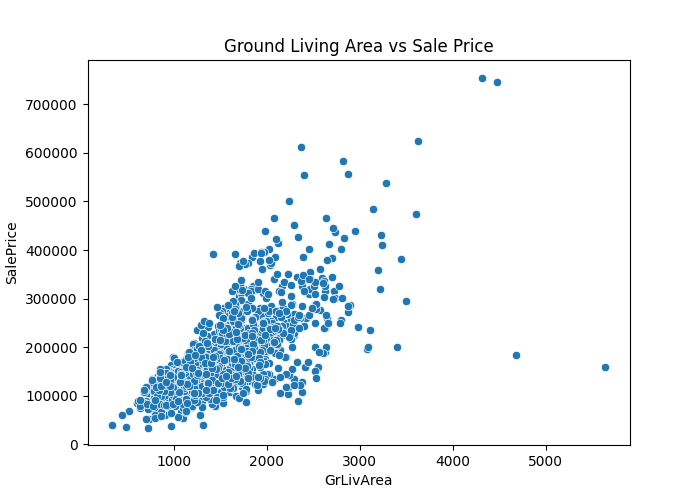
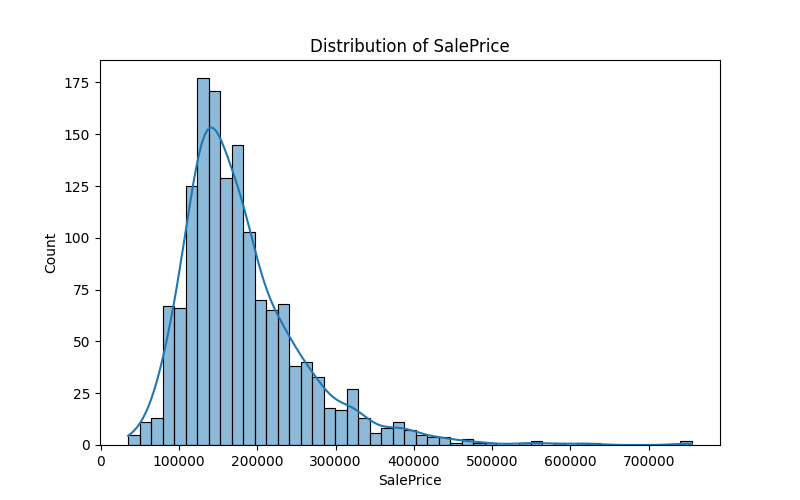
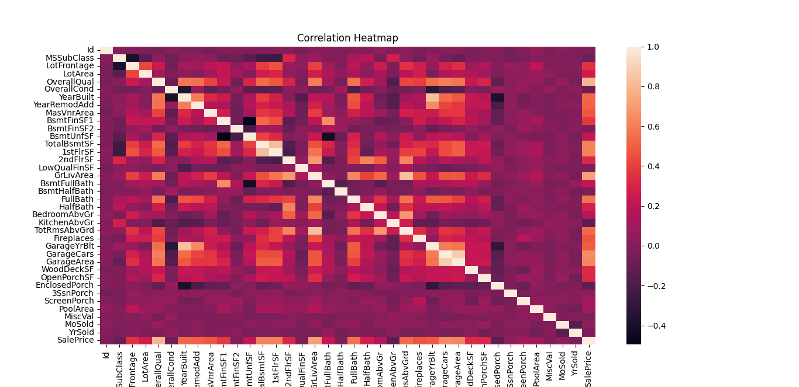
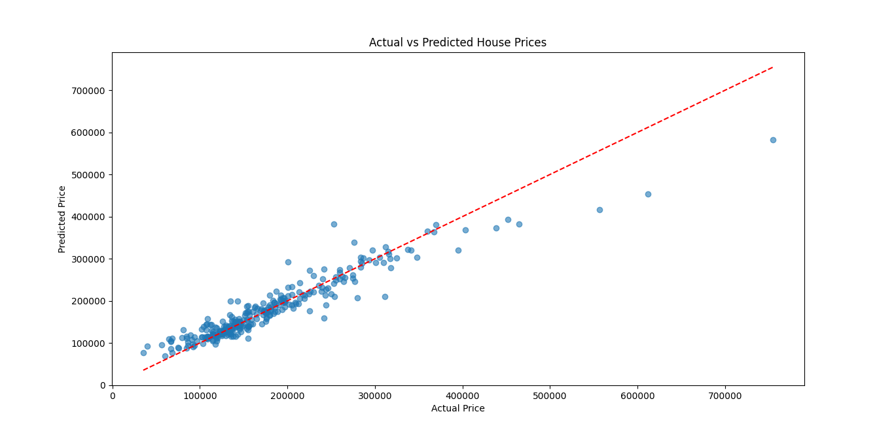

# 🏠 House Price Prediction using Random Forest Regression

A machine learning project that predicts residential house prices using the Ames Housing dataset. The project demonstrates a complete end-to-end machine learning workflow, including data preprocessing, feature engineering, model training, evaluation, and feature importance analysis.

---

## 📌 Project Overview

The objective of this project is to build a predictive model that estimates the selling price of residential properties based on various structural, neighborhood, and property characteristics.

A **Random Forest Regressor** was selected because it can model complex, non-linear relationships while being robust to overfitting and capable of handling a large number of features.

---

## 📂 Dataset

The project uses the **Ames Housing Dataset**, which contains detailed information on residential properties sold in Ames, Iowa.

Dataset characteristics:

- **Training observations:** 1,460
- **Original features:** 80
- **Target variable:** `SalePrice`

The dataset contains:

- Property size
- Neighborhood information
- Building quality
- Basement information
- Garage details
- Exterior materials
- Sale conditions
- Many additional housing characteristics

---

## 🛠 Data Preprocessing

Several preprocessing techniques were applied before model training.

### Handling Missing Values

Missing values were handled using different strategies depending on the variable.

- Median imputation for numerical variables
- "None" or "NA" for categorical variables representing the absence of a feature

Examples include:

- LotFrontage
- GarageYrBlt
- MasVnrArea
- PoolQC
- Fence
- FireplaceQu
- GarageType
- MiscFeature

---

### Feature Encoding

Categorical variables were encoded using two approaches.

#### Ordinal Encoding

Applied to variables with a natural ordering, including:

- OverallQual
- ExterQual
- ExterCond
- BsmtQual
- BsmtCond
- BsmtExposure
- BsmtFinType1
- BsmtFinType2
- HeatingQC
- KitchenQual
- Functional
- FireplaceQu
- GarageFinish
- GarageQual
- GarageCond
- Fence
- PoolQC
- PavedDrive
- Street
- LotShape
- LandSlope

#### One-Hot Encoding

Applied to nominal variables, including:

- MSZoning
- Neighborhood
- HouseStyle
- Foundation
- RoofStyle
- RoofMatl
- Exterior1st
- Exterior2nd
- MasVnrType
- Heating
- Electrical
- GarageType
- SaleType
- SaleCondition
- MiscFeature
- Condition1
- Condition2
- BldgType
- Utilities
- LotConfig
- LandContour

---

## ✂ Train-Test Split

The dataset was divided into training and testing sets using an 80:20 ratio.

| Dataset  | Samples |
| -------- | ------: |
| Training |   1,168 |
| Testing  |     292 |

---

## 🤖 Machine Learning Model

Model used:

- Random Forest Regressor

The model was trained using Scikit-learn's `RandomForestRegressor`.

---

## 📊 Model Performance

| Metric                         |                    Score |
| ------------------------------ | -----------------------: |
| Mean Absolute Error (MAE)      |      **17,738.19** |
| Mean Squared Error (MSE)       | **834,501,022.87** |
| Root Mean Squared Error (RMSE) |      **28,887.73** |
| R² Score                      |         **0.8912** |

### Results

The Regression Random Forest model successfully identified house prices.

Key evaluation metrics include:

* MAE
  `17,738.19`
* MSE
  `834,501,022.87`
* RMSE
  `28,887.73`
* R² Score
  `0.8912`

### Interpretation

The Random Forest model explains approximately **89.12%** of the variation in house prices.

On average, the model's predictions differ from the actual selling prices by approximately **17,738**.

The RMSE indicates that while the majority of predictions are accurate, larger prediction errors have a greater influence on the evaluation metric.

Overall, the model demonstrates strong predictive performance on unseen data.

---

## ⭐ Top 10 Most Important Features

| Rank | Feature      | Importance |
| ---: | ------------ | ---------: |
|    1 | OverallQual  |   0.233967 |
|    2 | GrLivArea    |   0.167884 |
|    3 | TotalBsmtSF  |   0.049267 |
|    4 | GarageCars   |   0.194624 |
|    5 | GarageArea   |   0.194624 |
|    6 | YearBuilt    |   0.014233 |
|    7 | 1stFlrSF     |   0.030945 |
|    8 | BsmtQual     |   0.040115 |
|    9 | KitchenQual  |   0.025873 |
|   10 | BsmtFullBath |   0.001485 |

---

## 📈 Feature Importance

The Random Forest model provides feature importance scores that indicate how much each feature contributes to the prediction of house prices.

Generally, overall house quality, living area, basement size, garage capacity, and construction year were among the most influential predictors.



## 📷 Results

Metrics generated by the model

- Model evaluation metrics
- Feature importance ranking
- Actual vs Predicted comparison
- Residual analysis











---

## 💻 Technologies Used

- Python
- Pandas
- NumPy
- Scikit-learn
- Matplotlib
- Visual Studio Code

---

## 🚀 How to Run

Clone the repository

```bash
git clone https://github.com/yourusername/House-Price-Prediction.git
```

Navigate to the project directory

```bash
cd House-Price-Prediction
```

Install dependencies

```bash
pip install -r requirements.txt
```

Run the project

```bash
python Random_Forest.py
```

---

## 📁 Project Structure

```
House-Price-Prediction/
│
├── data/
│   ├── train.csv
│   └── test.csv
│
├── images/
│
├── Random_Forest.py
├── requirements.txt
├── README.md
└── LICENSE
```

---

## 🔮 Future Improvements

- Hyperparameter tuning using GridSearchCV
- Cross-validation
- Compare with XGBoost and LightGBM
- Build a preprocessing pipeline using ColumnTransformer
- Deploy the model as a web application

---

## 👤Author

**Moses Kamau Chege**

Data Scientist | Data Analyst | Machine Learning Enthusiast

LinkedIn: https://www.linkedin.com/in/moses-chege/

GitHub: https://github.com/thugge254

---

## 📜 License

This project is licensed under the MIT License.
